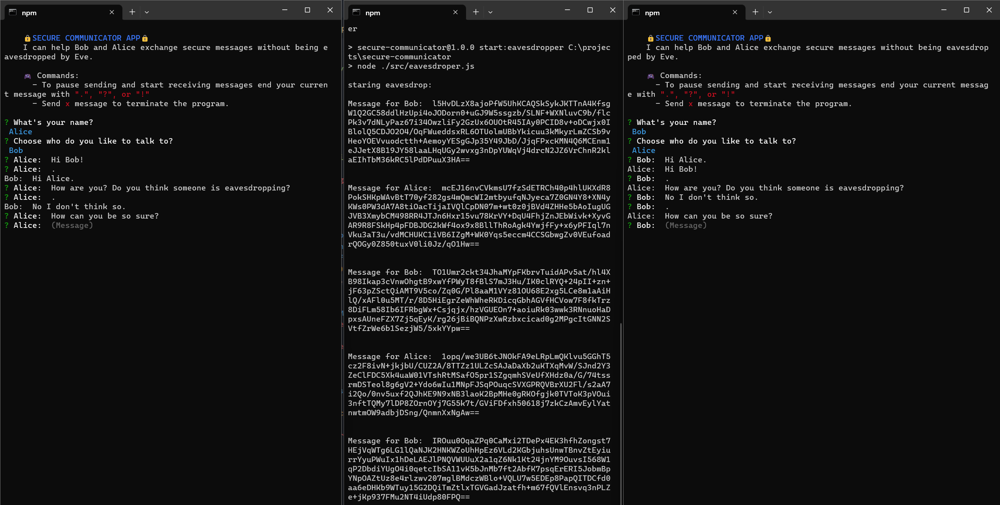

# Secure communicator app

Secure communicator app is a simple app that allows exchange of encrypted messages between Bob and Alice without being eavesdropped by Eve.

### How to:

- install dependencies: `npm install`
- start the communicator app: `npm run start:app`
- start the eavesdropper app: `npm run start:eavesdropper`
- run the tests: `npm run test`

### Used technologies

- Node.js
  - file system module
    - local files are used for the message exchange
  - crypto module
    - Asymmetric encryption, with public key-private key pairs is used to encrypt and decrypt the messages (only the public keys are stored in local files so that they can be used across multiple processes/application)
- Inquirer.js for CLI questions and input
- Jest.js for tests

### Potential improvements

- introduce sockets for more seamless communication
- add Typescript for better type safety of the code
- write more unit and integration tests
